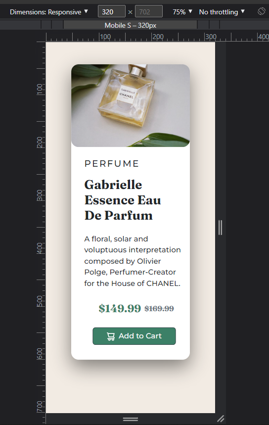
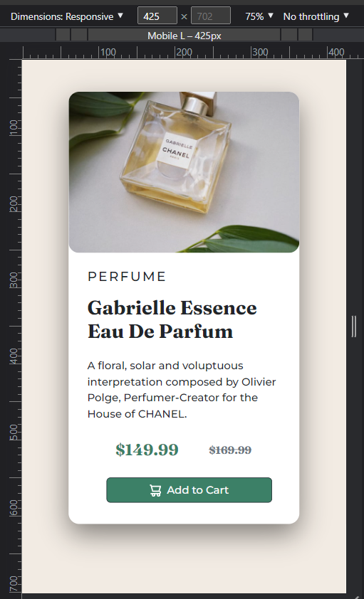
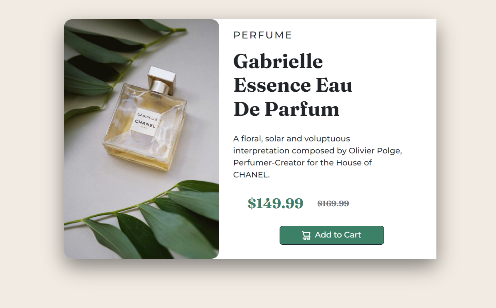

# Frontend Mentor - Product Preview Card Component

This is a solution to the [Product preview card component challenge on Frontend Mentor](https://www.frontendmentor.io/challenges/product-preview-card-component-GO7UmttRfa).
Frontend Mentor challenges help you improve your coding skills by building realistic projects.

## Table of contents

- [Overview](#overview)
  - [The challenge](#the-challenge)
  - [Screenshot](#screenshot)
  - [Links](#links)
- [My process](#my-process)
  - [Built with](#built-with)
  - [What I learned](#what-i-learned)
  - [Continued development](#continued-development)
  - [Useful resources](#useful-resources)
- [Author](#author)
- [Acknowledgments](#acknowledgments)
- [Suggestions/Feedbacks](#Suggestions/Feedbacks)

## Overview

### The challenge

Users should be able to:

- View the optimal layout depending on their device's screen size
- See hover and focus states for interactive elements
<hr>

### Screenshot

|                     **Mobile Small:**                     |                           **Laptop:**                            |
| :-------------------------------------------------------: | :--------------------------------------------------------------: |
|  |           |
|                     **Mobile Large:**                     |                       **Laptop/Desktop:**                        |
|  |  |
|                        **Tablet:**                        |                      **Original Clear BG:**                      |
|    |          |

<hr>

### Links

- Solution URL: [Click me](https://www.frontendmentor.io/solutions/responsive-and-mobilefirst-approach-design-using-figma-and-bootstrap-aRvVQ8lDh0)
- Live Site URL: [Click me](https://product-preview-card-component-beta-one.vercel.app/)

## My process

### Built with

- Semantic HTML5 markup
- CSS custom properties
- Mobile-first workflow
- [Bootstrap](https://getbootstrap.com/) - CSS Framework

### What I learned

- Mostly review about:
  - Responsive layouts
  - Bootstrap
- Utilize more of the bootstrap classes than the past.
- Create a documentation like this one, which is my first .md to seriously create.

### Continued development

- Planning to learn more about CSS Layouts (Grid and Flexbox)
- More responsive and accurate styling (margins, paddings, etc.)
- Looking forward to use CSS Tricks and more pseudo tricks in the future.
- More efficient approach in creating front-end designs, and much more.
- And lastly, implementation of Javascript in web development journey.

### Useful resources

- [Stack Overflow](https://www.stackoverflow.com) - I'll admit that i used this website a lot, searching for fixes while I progress.
- [W3schools](www.w3schools.com) - This helped me for XYZ reason. I really liked this pattern and will use it going forward.
- [W3docs](www.w3docs.com) - This helped me for learning more about Pseudo CSS and other deeper CSS tricks.
- [Coderjony](https://coderjony.com/blogs/media-queries-in-css-min-width-and-max-width) - A great article that helped me recall using media queries, specially min/max-width.

## Author

- Website - [My Github Profile](https://github.com/Iron-Mark)
- Frontend Mentor - [@Iron-Mark](https://www.frontendmentor.io/profile/Iron-Mark)
- Twitter - [@iron_markk](https://www.twitter.com/iron_markk)
- Instagram - [@iron_markk](https://www.instagram.com/iron_markk/)

## Acknowledgments

I would like to thank first in myself to do these things instead of just sleeping. Also to the internet and the websites I specified in the "Useful resources" section, or some that isn't, which is probably I forgot. Also to the FrontEndMentor for providing these resources for everyone to learn much easier, and not just get stuck in tutorial hell watching random videos.

## Suggestions/Feedbacks

### HTML validation report (1)

- Section lacks heading. Consider using `h2`-`h6` elements to add identifying headings to all sections.

```html
<section class="__col-1 col-12 col-md-5 col-lg-5 p-0"></section>
```

### Community Feedback:

- **Lucas 👾** • 105,240 [_(@correlucas)_](https://github.com/correlucas)

  - Fix the alignment of the whole content using `flex` and `min-height` to manage the vertical alignment and make everything centered:
    - First of all put `min-height: 100vh` to the `body` to make the body display 100% of the viewport height.
      - (This makes the container align to the height size that's now 100% of the screen height) size
    - `display: flex` and `flex-direction: column` to align the child element (the container) vertically using the body as reference.
    - ```css
      body {
        min-height: 100vh;
        display: flex;
        align-items: center;
        justify-content: center;
      }
      ```

  - A better way to work this solution image, the product image.
    - By using **`<picture>`** to wrap it on the html instead of using it as `` or `background-image` (with the css).
    - Using `<picture>` you wrap both images (desktop and mobile) and have more control over it.
      - You can set in the html when the images changes setting the screen size for each image that
      - For **SEO / search engine** reasons isn’t a better practice import this product image with CSS since this will make it harder to the image.
      - See the example below:
        ```html
        <picture>
          <source
            media="(max-width:650px)"
            srcset="./images/image-product-mobile.jpg"
          />
          
        </picture>
        ```

- **Thomas** • 150 [@Thomasvdk783](https://github.com/Thomasvdk783)
  - To center your main element you can do this in your css:
  ```css
  body {
    height: 100vh;
    display: flex;
    align-items: center;
  }
  ```

<br>

### Next Action (Soon):
- [X] Implement changes from community feedback
- [ ] TBA...


<br>

_Updated Feb 11, 2023_
