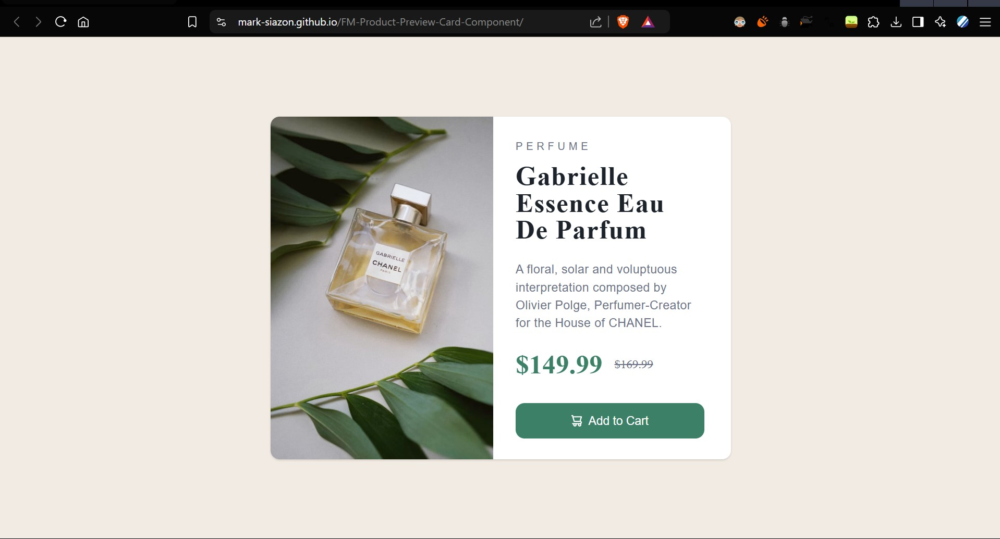
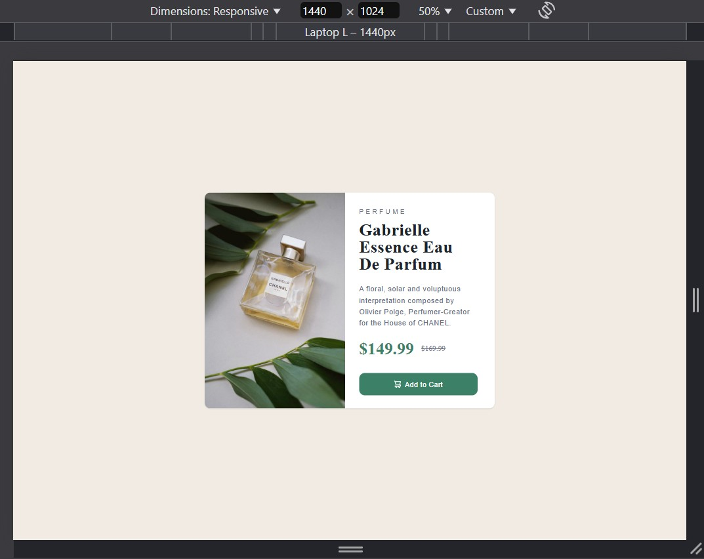
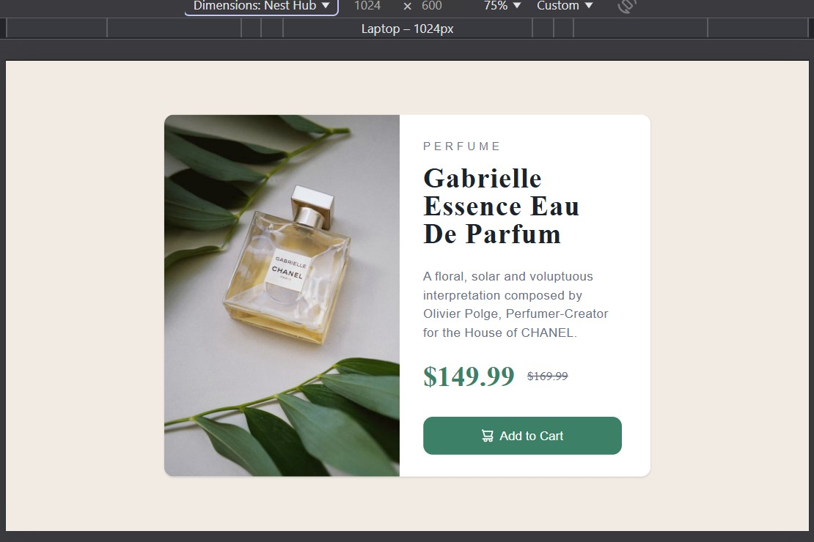
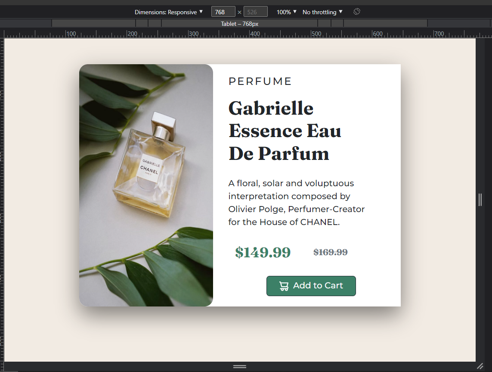
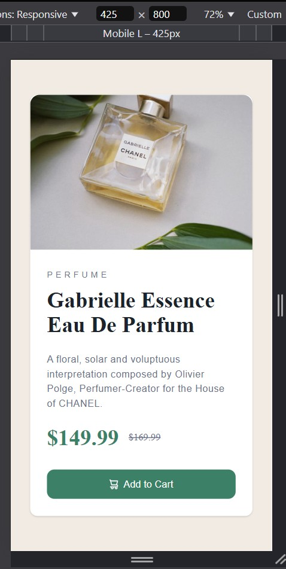
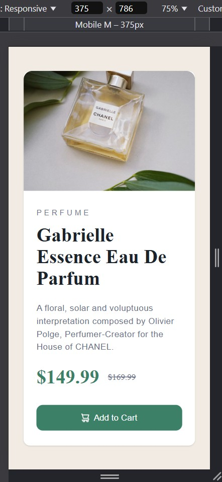
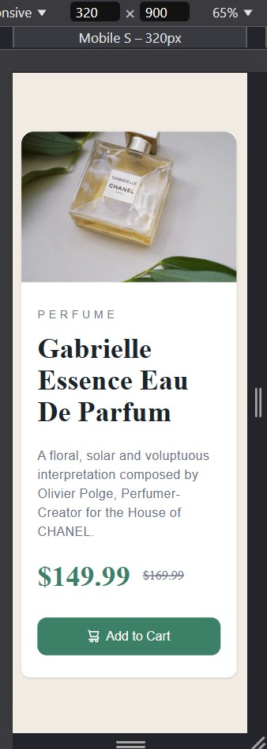

# Frontend Mentor - Product Preview Card Component

This is a solution to the [Product preview card component challenge on Frontend Mentor](https://www.frontendmentor.io/challenges/product-preview-card-component-GO7UmttRfa).
Frontend Mentor challenges help you improve your coding skills by building realistic projects.

## Table of contents

- [Overview](#overview)
  - [The challenge](#the-challenge)
  - [Screenshot](#screenshot)
  - [Links](#links)
- [My process](#my-process)
  - [Built with](#built-with)
  - [What I learned](#what-i-learned)
  - [Continued development](#continued-development)
  - [Useful resources](#useful-resources)
- [Author](#author)
- [Acknowledgments](#acknowledgments)
- [Suggestions/Feedbacks](#suggestionsfeedbacks)

## Overview

### The challenge

Users should be able to:

- View the optimal layout depending on their device's screen size
- See **hover**, **focus**, and **active** states for interactive elements

### Screenshot

 
  
**Fullscreen View (Desktop)**
| -------------------------------------------------- |
|  |

**Animated Preview:**
| -------------------------------------------------------- |
|  |
 

**Note: This is a Mobile-First Approach. Please wait for the GIF to load (It takes a while due to file size)**

 

All viewports were included (except for the 4k view).

 

| Desktop View (1440px)                             | Laptop View (1024px)                             | Tablet View (768px)                              |
| ------------------------------------------------- | ------------------------------------------------ | ------------------------------------------------ |
|  |  |  |

| Mobile L (430px)                                  | Mobile M (375px)                                  | Mobile S (320px)                                  |
| ------------------------------------------------- | ------------------------------------------------- | ------------------------------------------------- |
|  |  |  |

### Links

- Solution URL: [Click me](https://www.frontendmentor.io/solutions/product-prevw-card-responsive-mobile-first-tsreactjsvitetailwind-gh-YMDqrQX)
- Live Site URL: [Click me](https://mark-siazon.github.io/FM-Product-Preview-Card-Component/)

## My process

### Built with

- **Version 2 (Latest)** (Upgraded from basic HTML, CSS, and Bootstrap to a modern tech stack)

  - React + TypeScript
  - Vite for faster development
  - Tailwind CSS for utility-first styling
  - Improved and more accurate UI/UX design

- **Version 1 (Old)** (Originally built two years ago)
  - Semantic HTML5 markup
  - CSS custom properties
  - Mobile-first workflow
  - [Bootstrap 4](https://getbootstrap.com/) - CSS Framework

### What I learned

- Significant improvement in UI/UX accuracy based on project requirements.
- Transitioning from Bootstrap to Tailwind CSS for better flexibility.
- Leveraging TypeScript for type safety and scalability.
- Optimized component-based structure using React.
- Documentation writing (this project introduced me to structured `README.md` creation).

### Continued development

- Enhancing React component reusability and optimization.
- Exploring advanced Tailwind CSS configurations.
- Improving accessibility and performance best practices.
- More refined state management solutions.
- Integrating backend logic for future scalability.

### Useful resources

- [Tailwind CSS Docs](https://tailwindcss.com/docs) - Official documentation for utility-first styling.
- [React Docs](https://react.dev/) - Comprehensive guide for building modern UI components.
- [Vite Documentation](https://vitejs.dev/) - Helped in understanding faster frontend tooling.
- [TypeScript Handbook](https://www.typescriptlang.org/docs/) - Essential for writing type-safe React components.
- [MDN Web Docs](https://developer.mozilla.org/) - Go-to reference for HTML, CSS, and JavaScript concepts.
- [Josh Comeau’s Blog](https://www.joshwcomeau.com/) - Great insights on modern frontend best practices.
- [CSS Tricks](https://css-tricks.com/) - Advanced CSS techniques and UI design patterns.
- [Frontend Mentor Community](https://www.frontendmentor.io/) - Feedback and inspiration from other frontend developers.

## Author

- Website - [My Github Profile](https://github.com/Iron-Mark)
- Frontend Mentor - [@Iron-Mark](https://www.frontendmentor.io/profile/Iron-Mark)
- Twitter - [@iron_markk](https://www.x.com/iron_markk)
- Instagram - [@iron_markk](https://www.instagram.com/iron_markk/)

## Acknowledgments

I would like to thank first in myself to do these things instead of just sleeping. Also to the internet and the websites I specified in the "Useful resources" section, or some that isn't, which is probably I forgot. Also to the FrontEndMentor for providing these resources for everyone to learn much easier, and not just get stuck in tutorial hell watching random videos.

## Suggestions/Feedbacks

 

v2 (Latest): _Feb 9, 2025_
v1: _Feb 11, 2023_
